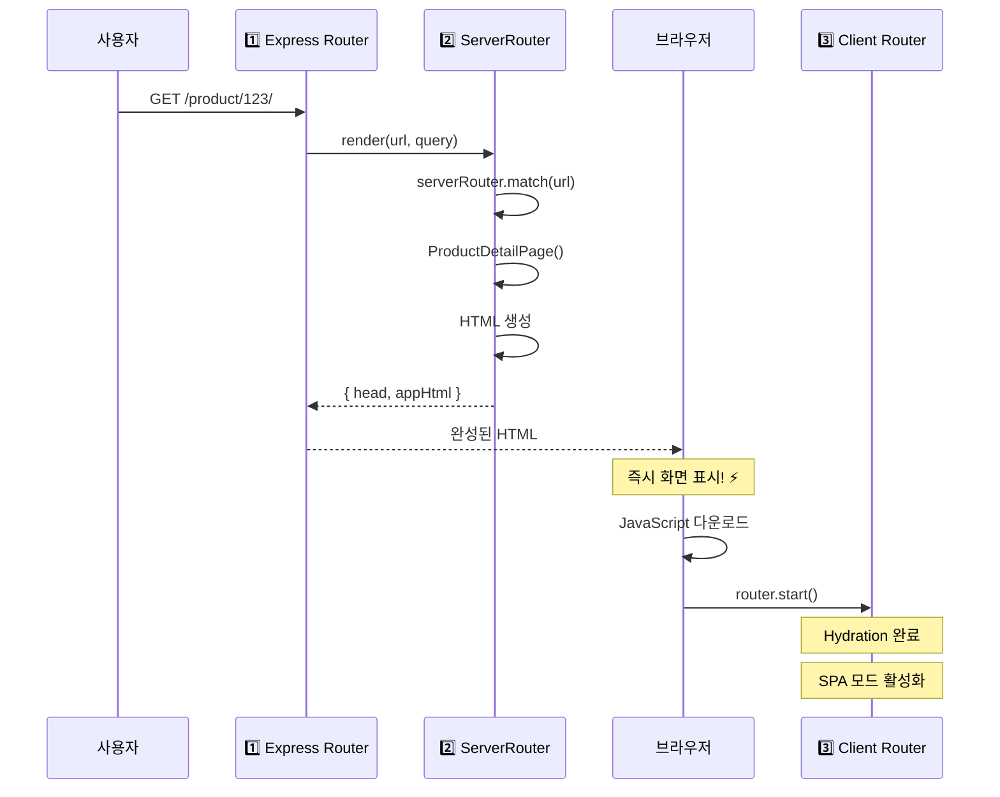
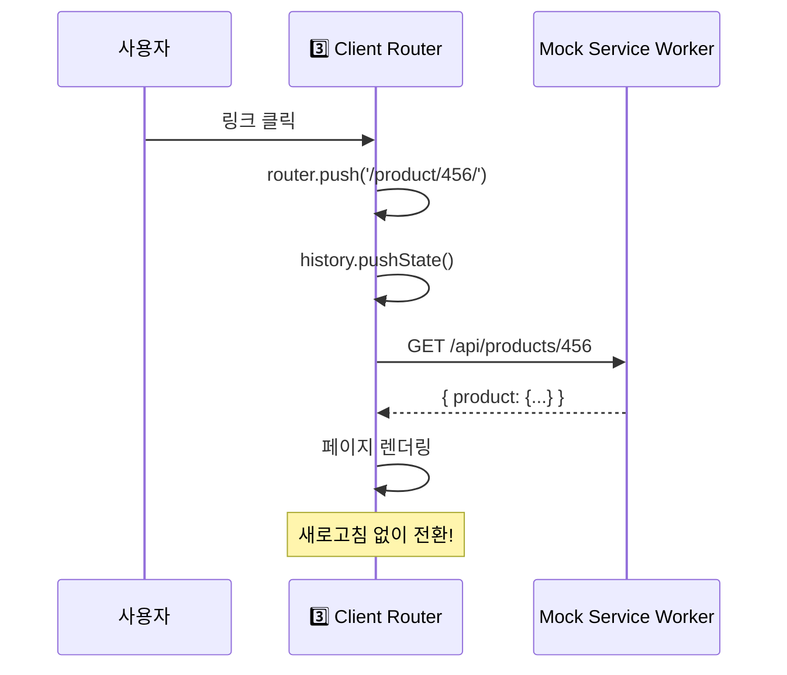

# Router 구조 완벽 가이드

SSR 프로젝트에서 사용되는 3가지 Router의 역할과 동작 시점을 설명합니다.

---

## 📋 목차

1. [세 가지 Router 개요](#세-가지-router-개요)
2. [언제 어떤 Router가 동작하나?](#언제-어떤-router가-동작하나)
3. [실제 코드 예시](#실제-코드-예시)
4. [전체 흐름도](#전체-흐름도)
5. [FAQ](#faq)

---

## 세 가지 Router 개요

### 1. Express Router (server.js)

```javascript
위치: packages/vanilla/server.js
역할: HTTP 요청을 받아서 SSR render() 호출
환경: Node.js (Express 서버)
```

**코드**:

```javascript
// server.js (이미 구현되어 있음)
app.use(async (req, res, next) => {
  const url = req.originalUrl;
  const out = await render(url, req.query);
  const html = applyTemplate(template, out);
  res.send(html);
});
```

**역할**: 웹서버의 라우팅 (모든 HTTP 요청 처리)

---

### 2. ServerRouter (src/lib/ServerRouter.js)

```javascript
위치: packages/vanilla/src/lib/ServerRouter.js
역할: SSR 시 URL을 분석해서 어떤 페이지를 렌더링할지 결정
환경: Node.js (render 함수 내부)
```

**코드**:

```javascript
// main-server.js (방금 수정한 파일)
import { ServerRouter } from "./lib/ServerRouter.js";

const serverRouter = new ServerRouter("/");
serverRouter.addRoute("/", HomePage);
serverRouter.addRoute("/product/:id/", ProductDetailPage);

const matched = serverRouter.match(url);
// → { handler: ProductDetailPage, params: { id: '123' } }
```

**역할**: URL → 페이지 컴포넌트 매칭 (서버에서)

---

### 3. Client Router (src/lib/Router.js)

```javascript
위치: packages/vanilla/src/lib/Router.js
역할: 브라우저에서 SPA 페이지 전환 (새로고침 없이)
환경: 브라우저
```

**코드**:

```javascript
// main.js (기존 코드 - 그대로 유지)
import { router } from "./router";

router.subscribe(render);
router.start();

// 사용자가 링크 클릭하면
router.push("/product/456/"); // 새로고침 없이 전환!
```

**역할**: SPA 페이지 전환 (클라이언트에서)

---

## 언제 어떤 Router가 동작하나?

### 시나리오 A: 사용자가 URL을 직접 입력 (첫 방문)

```
브라우저 주소창: https://example.com/product/123/ [Enter]
```

**동작 순서**:

```
Step 1: Express Router (server.js)
  ↓ HTTP 요청 수신
  ↓ render(url, query) 호출

Step 2: ServerRouter (main-server.js)
  ↓ URL 매칭: '/product/123/'
  ↓ 결과: ProductDetailPage, params: { id: '123' }
  ↓ 데이터 로드 (items.json)
  ↓ HTML 생성

Step 3: 브라우저로 HTML 전송
  ↓ 사용자가 즉시 화면 봄! ⚡

Step 4: JavaScript 다운로드 & 실행
  ↓ Client Router 초기화
  ↓ Hydration 완료
  ↓ 이제 SPA 모드로 전환됨
```

**사용된 Router**: 1️⃣ Express → 2️⃣ ServerRouter → 3️⃣ Client Router (초기화)

---

### 시나리오 B: 사용자가 앱 내에서 다른 페이지로 이동

```
[다른 상품 카드 클릭]
```

**동작 순서**:

```
Step 1: Client Router만 동작! (main.js)
  ↓ router.push('/product/456/')
  ↓ History API 사용 (pushState)
  ↓ 페이지 컴포넌트 렌더링
  ↓ MSW로 데이터 로드 (브라우저 내)

결과: 새로고침 없이 페이지 전환 (빠름!)
```

**사용된 Router**: 3️⃣ Client Router만!

---

### 시나리오 C: 사용자가 새로고침 (F5)

```
[현재 페이지에서 F5 또는 Cmd+R]
```

**동작 순서**:

```
→ 시나리오 A와 동일
→ 서버에서 다시 SSR 수행
```

**사용된 Router**: 1️⃣ Express → 2️⃣ ServerRouter → 3️⃣ Client Router (초기화)

---

## 실제 코드 예시

### 파일별 Router 사용 위치

```
packages/vanilla/
├── server.js                    ← 1️⃣ Express Router
│   app.use((req, res) => {
│     const out = await render(req.url);
│   });
│
├── src/
│   ├── main-server.js           ← 2️⃣ ServerRouter 사용
│   │   const serverRouter = new ServerRouter();
│   │   const matched = serverRouter.match(url);
│   │
│   ├── main.js                  ← 3️⃣ Client Router 사용
│   │   import { router } from './router';
│   │   router.start();
│   │
│   └── lib/
│       ├── ServerRouter.js      ← 2️⃣ 정의
│       └── Router.js            ← 3️⃣ 정의
```

---

## 전체 흐름도

### 첫 방문 (SSR)



### 페이지 이동 (CSR)



---

## FAQ

### Q1: 왜 세 개나 필요한가요?

**A**: 각자 역할이 완전히 다릅니다.

| Router        | 역할           | 예시                        |
| ------------- | -------------- | --------------------------- |
| Express       | HTTP 요청 처리 | 웹서버 기본 기능            |
| ServerRouter  | SSR URL 매칭   | 어떤 페이지 렌더링할지 결정 |
| Client Router | SPA 전환       | 새로고침 없이 페이지 이동   |

### Q2: Express Router만 쓰면 안 되나요?

**A**: Express Router는 HTTP 요청만 처리합니다.

- ❌ "/product/:id/"같은 패턴 매칭 기능 없음
- ❌ 페이지 컴포넌트 관리 안 함
- → ServerRouter가 필요!

### Q3: ServerRouter와 Client Router를 하나로 합치면 안 되나요?

**A**: 환경이 달라서 불가능합니다.

```javascript
// Client Router - window 사용
window.addEventListener('popstate', ...);
history.pushState(...);

// ServerRouter - window 없음!
// 순수 문자열 처리만
```

### Q4: 개발 환경(dev)에서는?

**개발 시나리오별 사용 Router**:

| 명령어             | 사용되는 Router               |
| ------------------ | ----------------------------- |
| `pnpm run dev`     | 3️⃣ Client Router만 (CSR 모드) |
| `pnpm run dev:ssr` | 1️⃣ + 2️⃣ + 3️⃣ 모두 (SSR 모드)  |

### Q5: 배포 환경(production)에서는?

**배포 시나리오별**:

| 배포 방식            | 사용되는 Router    |
| -------------------- | ------------------ |
| GitHub Pages (SSG)   | 3️⃣ Client Router만 |
| Vercel/Netlify (SSR) | 1️⃣ + 2️⃣ + 3️⃣ 모두  |

---

## 정리

### 핵심 3줄 요약

1. **Express Router**: HTTP 요청 받아서 SSR 시작
2. **ServerRouter**: SSR 시 URL → 페이지 선택
3. **Client Router**: 브라우저에서 SPA 전환

### 언제 동시에 사용?

**SSR 모드**일 때만 세 개 모두 사용!

- 첫 방문: 1️⃣ → 2️⃣ → 3️⃣
- 페이지 이동: 3️⃣만
- 새로고침: 1️⃣ → 2️⃣ → 3️⃣

**CSR 모드**일 때는 3️⃣만 사용!

- `pnpm run dev` 실행 시
